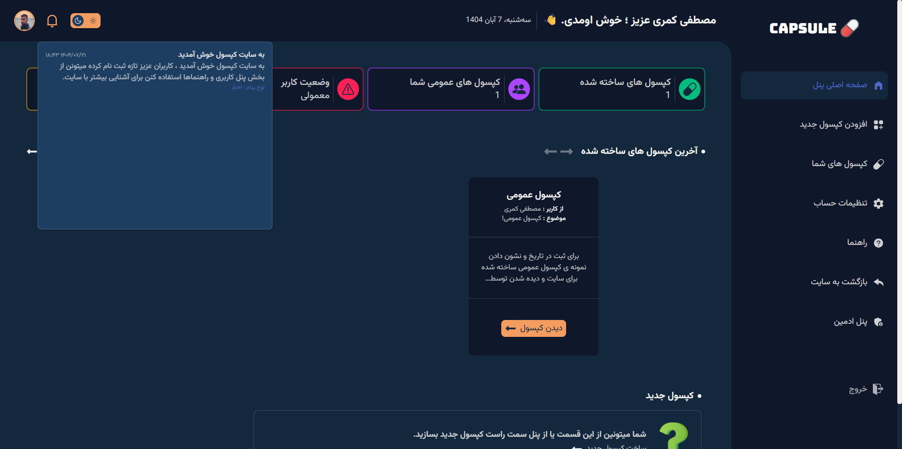
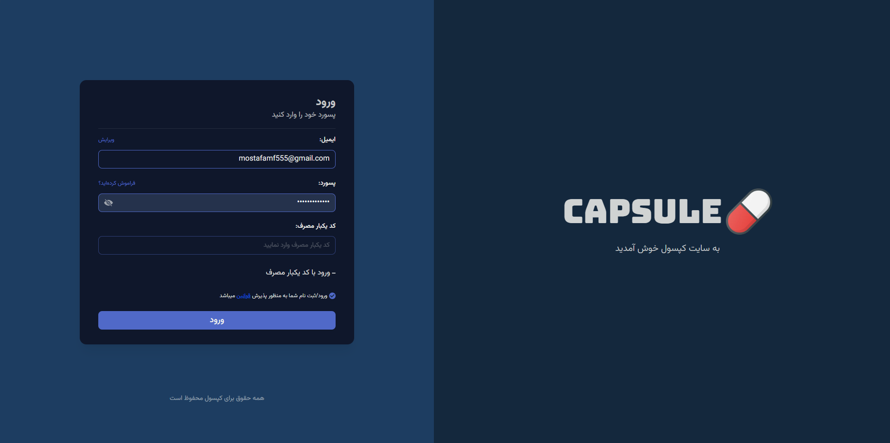
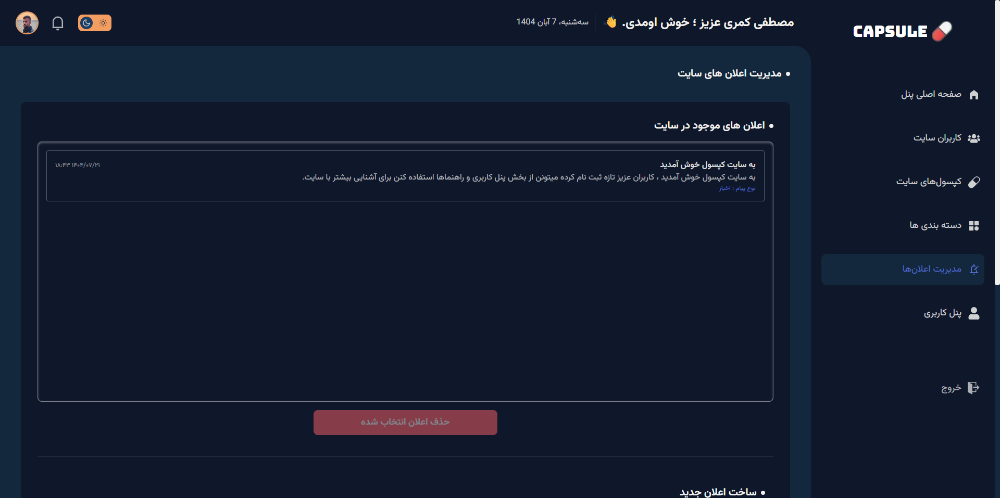
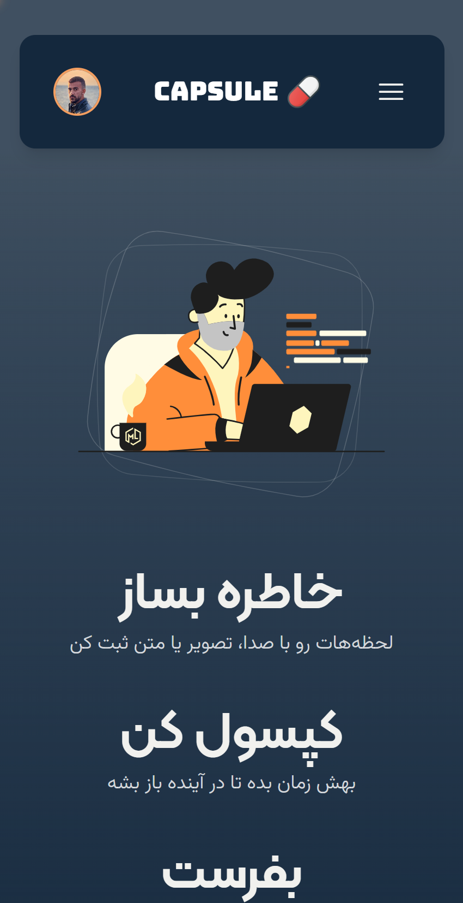
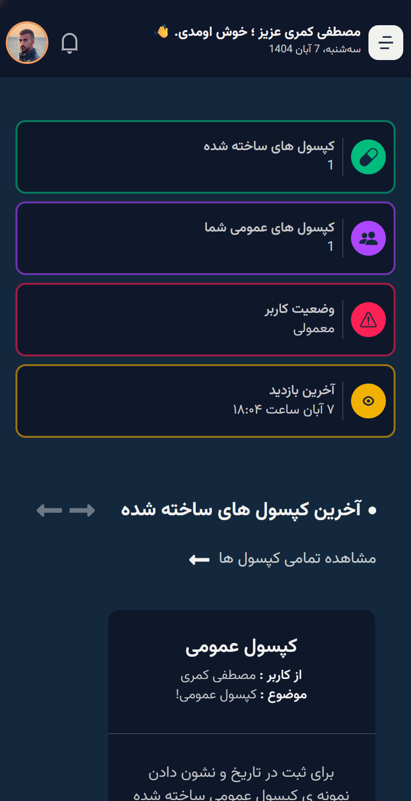
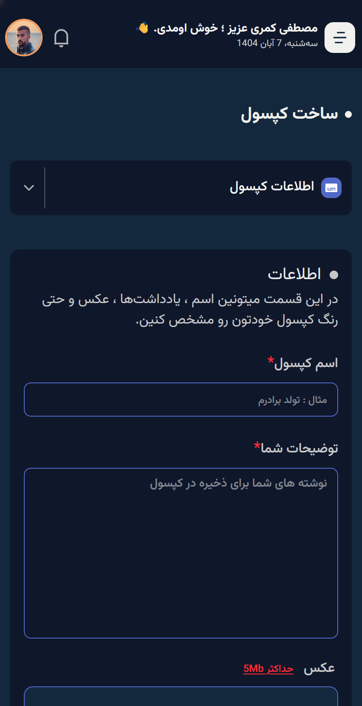

# 🌌 کپسول — نگهدارنده‌ی زمان و خاطره‌ها

> **کپسول** یک زمان‌نگهداره برای خاطره‌هاست.

• [دیدن سایت](https://www.capsule-memo.ir)

خاطراتت رو با **صدا، تصویر یا نوشته** درون یک کپسول قرار بده، زمان باز شدنش رو مشخص کن، و بذار بمونه... تا روزی که برگردی و دوباره بخونیش.
برای خودت، برای یه عزیز، یا شاید برای کسی که هنوز پیداش نکردی.

[English](./README.md)

---

## ✨ ویژگی‌ها

- ⏳ ساخت کپسول‌های زمانی با متن، تصویر یا صدا
- 🎧 امکان افزودن صدای شخصی یا ضبط‌شده به هر کپسول
- 🗓️ تعیین تاریخ و ساعت دقیق برای باز شدن کپسول
- 🔒 پنهان ماندن کپسول‌ها تا زمان مشخص‌شده
- 💌 مناسب برای خاطرات شخصی، پیام به آینده، یا هدیه‌ای احساسی
- 🖥️ طراحی مینیمال و زیبا برای داشبورد
- 📱 کاملاً واکنش‌گرا و مناسب برای موبایل و دسکتاپ

---

## 📁 تصاویر سایت

| 🏠 صفحه اصلی | 🧭 پنل کاربری |
|---------------|---------------|
|  |  |

| 🔑 صفحه ورود | 🌐 کپسول‌های عمومی |
|---------------|--------------------|
|  |  |

| 🛎️ اعلان‌های ادمین | 📱 حالت موبایل ۱ |
|------------------|------------------|
|  |  |

| 📱 حالت موبایل ۲ | 📱 حالت موبایل ۳ |
|------------------|------------------|
|  |  |

## 🧠 تکنولوژی‌ها

- **Next.js (App Router)**
- **React**
- **TypeScript**
- **Redux Toolkit**
- **Axios**
- **Tailwind CSS**
- **ShadCN/UI**
- **React Hook Form**

---

## 📁 ساختار پروژه

```
app/
 ├── (site routes)         # مسیرهای عمومی سایت (خانه، درباره، کپسول‌ها و...)
 ├── (dashboard)    # داشبورد کاربر برای مدیریت کپسول‌ها
 ├── login          # صفحات ورود و احراز هویت
 ├── hooks          # هوک های ساخته شده
 ├── components/    # کامپوننت‌های قابل استفاده مجدد
 ├── lib/           # توابع کمکی و ابزارها
 ├── store/         # پیکربندی و Sliceهای Redux
 └── services/        # پیکربندی اتصال به API
```

---

## ⚙️ نحوه اجرا در محیط محلی

کلون کردن پروژه:

```bash
git clone https://github.com/mostafakm78/Capsule
```

ورود به پوشه پروژه:

```bash
cd capsule
```

نصب پکیج‌ها:

```bash
npm install
```

اجرای سرور توسعه:

```bash
npm run dev
```

سپس پروژه از آدرس [http://localhost:3000](http://localhost:3000) در مرورگر در دسترس خواهد بود.

---

## 🪶 نام‌گذاری پوشه‌ها

- `app/(site)` → مسیرهای اصلی عمومی
- `app/(dashboard)` → مسیرهای داشبورد
- `app/login` → صفحات ورود و ثبت‌نام

---

## 🚀 نقشه راه

- [ ] افزودن سیستم احراز هویت و نقش کاربر
- [ ] امکان اشتراک‌گذاری کپسول‌ها از طریق لینک

---

## 💡 چشم‌انداز پروژه

کپسول فقط یک اپ نیست — **یک ماشین زمان دیجیتال**ه.
بهت کمک می‌کنه حس‌ها، صداها و لحظه‌هایی رو که ارزش دوباره زنده شدن دارن، برای آینده نگه داری.

---

## 📜 لایسنس

این پروژه **متن‌باز (Open Source)** بوده و تحت لایسنس [MIT](LICENSE) منتشر شده است.

---

## 🧑‍💻 سازنده

**مصطفی کمری**
توسعه‌دهنده فرانت‌اند | React & Next.js
[GitHub](https://github.com/mostafakm78) • [LinkedIn](http://linkedin.com/in/mostafa-kamari-b82450351)
