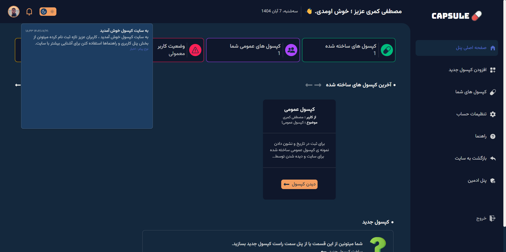
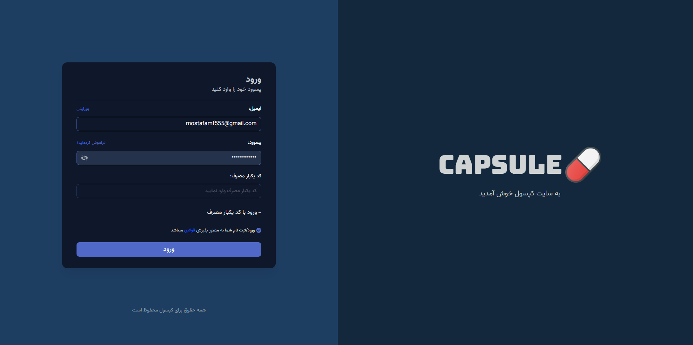
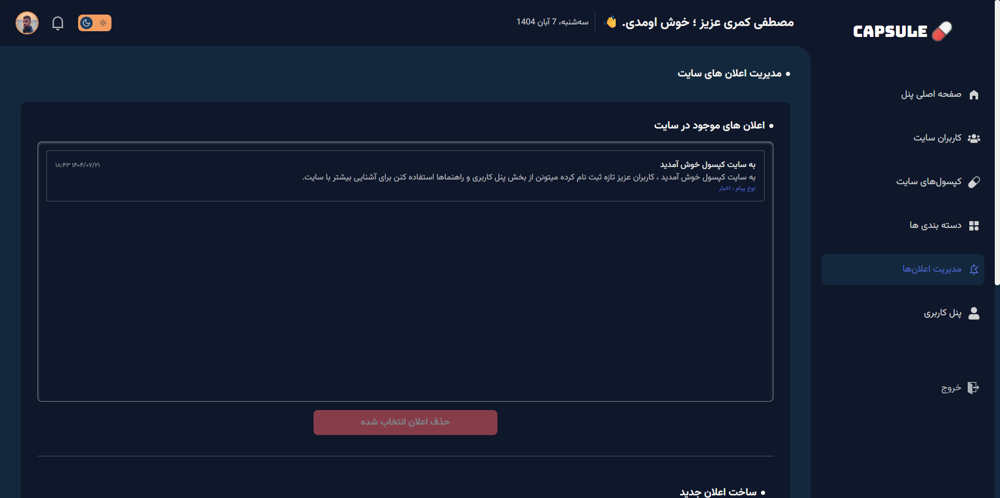
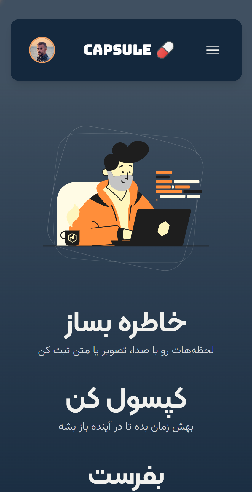

# 🌌 کپسول — نگهدارنده‌ی زمان و خاطره‌ها

> **کپسول** یک زمان‌نگهداره برای خاطره‌هاست.

🔗 [دیدن سایت](https://www.capsule-memo.ir) · [English](./README.md)

خاطراتت رو با **صدا، تصویر یا نوشته** درون یک کپسول قرار بده، زمان باز شدنش رو مشخص کن، و بذار بمونه... تا روزی که برگردی و دوباره بخونیش.

برای خودت، برای یه عزیز، یا شاید برای کسی که هنوز پیداش نکردی.

---

## ✨ ویژگی‌ها

- ⏳ ساخت کپسول‌های زمانی با متن، تصویر یا صدا
- 🎧 امکان افزودن صدای شخصی یا ضبط‌شده به هر کپسول
- 🗓️ تعیین تاریخ و ساعت دقیق برای باز شدن کپسول
- 🔒 پنهان ماندن کپسول‌ها تا زمان مشخص‌شده
- 🛎️ داشبورد ادمین با مدیریت اعلان‌ها و کاربران
- 🔑 احراز هویت JWT با مسیرهای محافظت‌شده
- 🖥️ رابط کاربری مینیمال و تمیز
- 📱 کاملاً واکنش‌گرا — تست‌شده از ۳۲۰ تا ۱۴۴۰ پیکسل

---

## 📁 تصاویر سایت

| 🏠 صفحه اصلی | 🧭 پنل کاربری |
|---|---|
|  |  |

| 🔑 صفحه ورود | 🌐 کپسول‌های عمومی |
|---|---|
|  |  |

| 🛎️ اعلان‌های ادمین | 📱 حالت موبایل |
|---|---|
|  |  |

---

## 🧠 تکنولوژی‌ها

| لایه | تکنولوژی |
|---|---|
| فریم‌ورک | Next.js 14 (App Router) |
| زبان | TypeScript |
| مدیریت state | Redux Toolkit |
| استایل‌دهی | Tailwind CSS + shadcn/ui |
| فرم‌ها | React Hook Form |
| ارتباط با API | Axios |
| استقرار | Vercel |

---

## ⚡ جزئیات فنی

- **پرفورمنس**: امتیاز Lighthouse بالای ۹۰ از طریق بهینه‌سازی تصویر Next.js، dynamic import و code splitting مبتنی بر route
- **معماری**: ساختار پوشه‌بندی feature-based با Redux Toolkit slice جداگانه برای هر دامنه (کپسول‌ها، احراز هویت، اعلان‌ها)
- **فرم‌ها**: React Hook Form برای تمام ورودی‌های کاربر با اعتبارسنجی سمت کلاینت
- **لایه API**: نمونه Axios متمرکز با interceptor برای تزریق توکن و مدیریت یکپارچه خطاها
- **احراز هویت**: JWT با محافظت از مسیرها بر اساس نقش کاربر (کاربر عادی / ادمین)
- **واکنش‌گرایی**: طراحی mobile-first، کاملاً کاربردی در تمام اندازه‌های صفحه

---

## 📁 ساختار پروژه

```
app/
├── (site)/          # مسیرهای عمومی — خانه، درباره، کپسول‌ها
├── (dashboard)/     # داشبورد محافظت‌شده کاربر
├── login/           # صفحات ورود و احراز هویت
├── components/      # کامپوننت‌های قابل استفاده مجدد
├── lib/             # توابع کمکی و ابزارها
├── store/           # پیکربندی و Sliceهای Redux
└── services/        # نمونه Axios و لایه سرویس API
```

---

## ⚙️ نحوه اجرا در محیط محلی

```bash
# کلون کردن پروژه
git clone https://github.com/mostafakm78/Capsule.git

# ورود به پوشه پروژه
cd Capsule

# نصب پکیج‌ها
npm install

# اجرای سرور توسعه
npm run dev
```

سپس پروژه از آدرس [http://localhost:3000](http://localhost:3000) در مرورگر در دسترس خواهد بود.

---

## 🚀 نقشه راه

### ✅ پیاده‌سازی‌شده
- [x] احراز هویت JWT با مسیرهای محافظت‌شده
- [x] دسترسی مبتنی بر نقش — کاربر عادی و ادمین
- [x] داشبورد اعلان‌های ادمین
- [x] ساخت کپسول با متن، تصویر و صدا
- [x] مکانیزم باز شدن زمان‌بندی‌شده
- [x] مرور کپسول‌های عمومی

### 🔜 آینده
- [ ] اشتراک‌گذاری کپسول از طریق لینک عمومی
- [ ] اعلان ایمیلی هنگام باز شدن کپسول
- [ ] واکنش و کامنت روی کپسول‌ها

---

## 📜 لایسنس

این پروژه متن‌باز بوده و تحت لایسنس [MIT](LICENSE) منتشر شده است.

---

## 🧑‍💻 سازنده

**مصطفی کمری** — توسعه‌دهنده فرانت‌اند · React & Next.js

[GitHub](https://github.com/mostafakm78) · [LinkedIn](https://linkedin.com/in/mostafa-kamari) · [پورتفولیو](https://portfolio-immostafakamari.vercel.app)
